本项目仅用于学习。
### 项目介绍
项目参考于网易云音乐官网，基本实现官方音乐播放、MV播放所有功能
### 后端API
本项目后端所有数据来自开源项目NeteaseCloudMusicApi，下面附有后端开源项目地址、文档

[后端API仓库地址](https://github.com/Binaryify/NeteaseCloudMusicApi)     

[API文档](https://neteasecloudmusicapi.vercel.app/#/)
### 运行项目
1. 运行后端仓库

    1.1. git clone 后端仓库地址

    1.2. cnpm install

    1.3. node app

2. 运行本仓库代码

    2.1. git clone 本仓库地址

    2.2. cnpm install

    2.3. npm run serve
### 项目效果预览
| 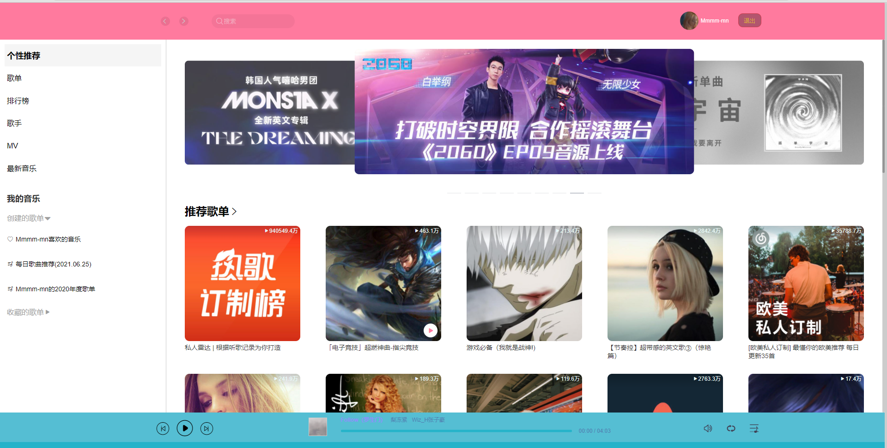  | 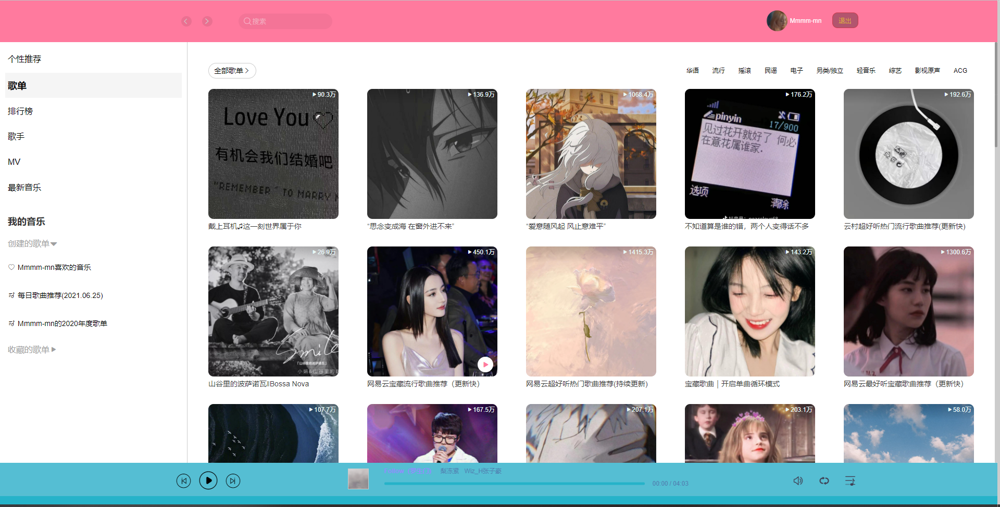  |  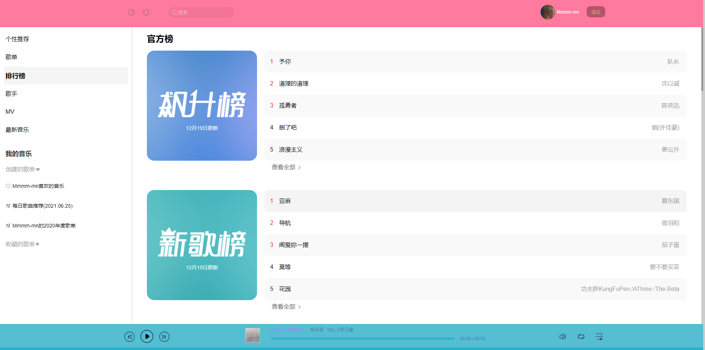 |  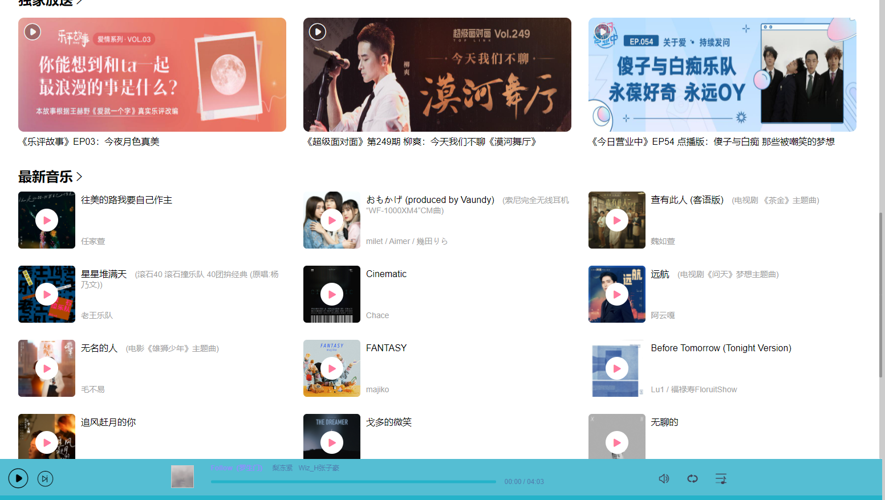 |
|---|---|---|---|
|  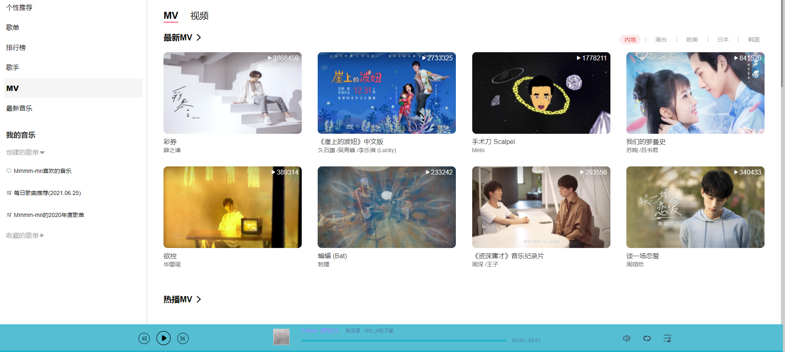 |  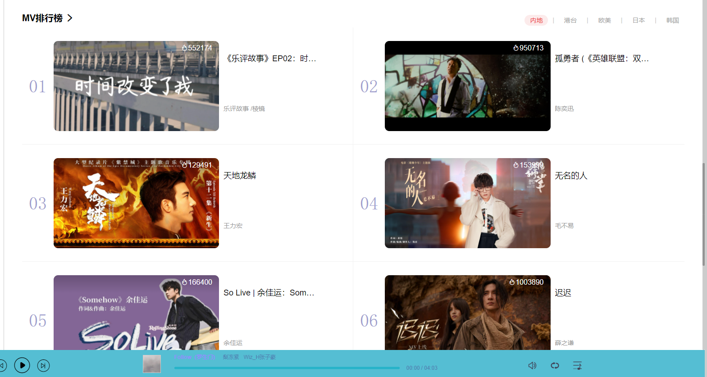 |  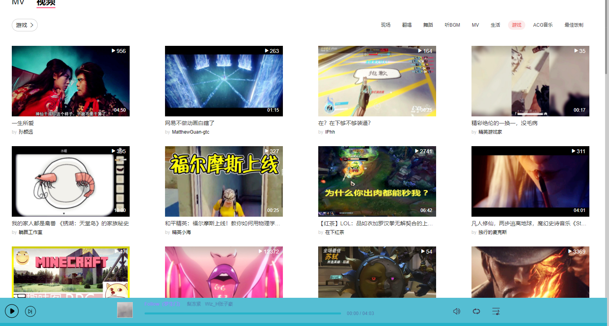 |   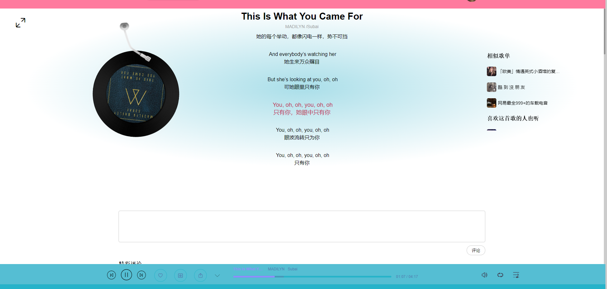|
|  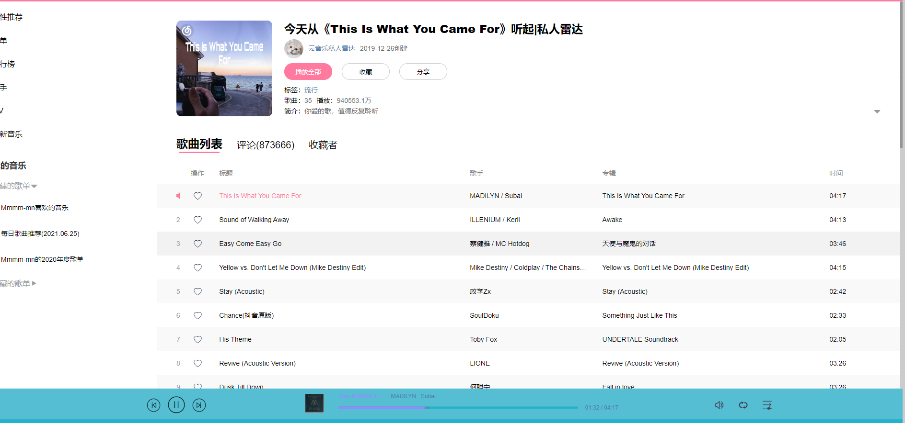 |  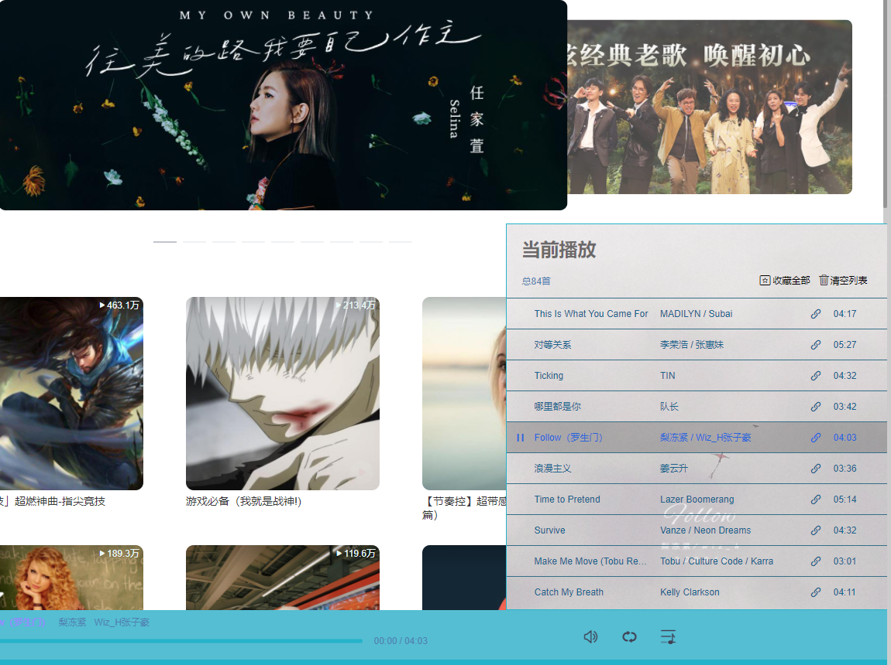 |  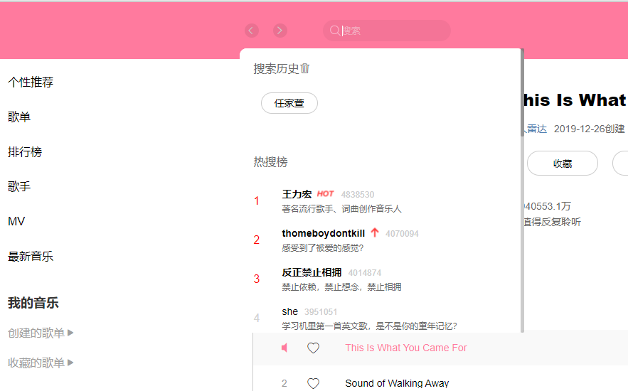 |  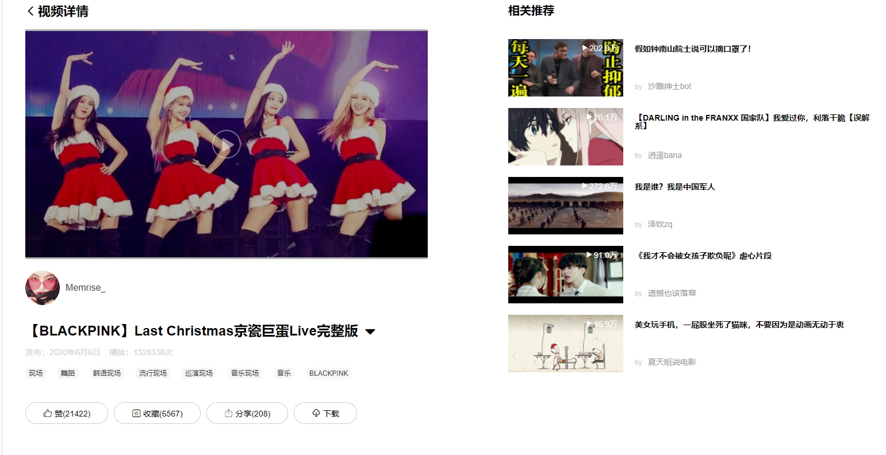 |

